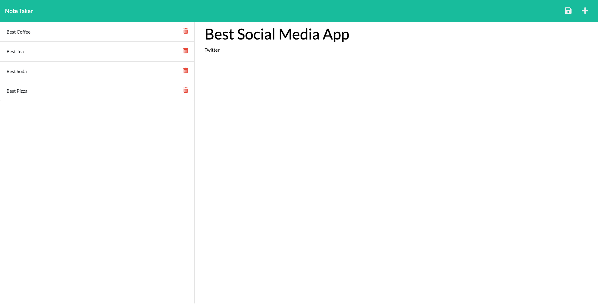

# MultiNoteApp

## Description
This note taker app is used to write, save and delete a users notes. The Application is deployed on Heroku and uses Express.js back end.

## Table of Contents
* [Installation](#installation)
* [Links](#Links)
* [Usage](#usage)
* [License](#license)
* [Contribute](#contribute)
* [Tests](#tests)
* [Questions](#questions)

## Installation
If you want to run a copy of this app on your local machine, first clone the repository:

Clone Via HTTPS:
```$ git clone https://github.com/Steven-McCombe/MultiNoteApp.git```

Clone Via SSH:
```$ git clone git@github.com:Steven-McCombe/MultiNoteApp.git```

Cd/ into the cloned directory and install the dependencies by typing the following into the command line
```$ npm install --save```

To start the application type the following into the address bar
```$ node server.js```

Navigate to the below address in your browser
```localhost:3005```

## Links
[Link to the Deployed Application](https://vast-taiga-79786.herokuapp.com)
## Usage
Video Demonstration (click image):

[](https://watch.screencastify.com/v/EDhBGtwSEtfvfi7BRPxW )

## License 
   

  [Read more about MIT License here.](https://opensource.org/licenses/MIT)
  
  

## Contribute
N/A

## Tests
N/A

## Questions
Contact Links:
- [Github Profile](https://github.com/STEVEN-MCCOMBE)
- [E-mail Me](mailto:smccombe93@gmail.com)

